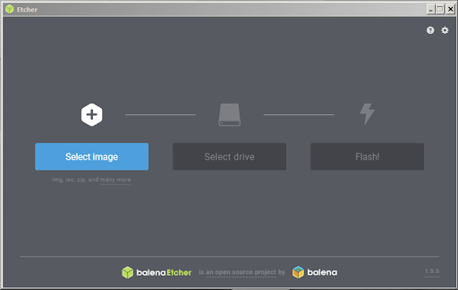
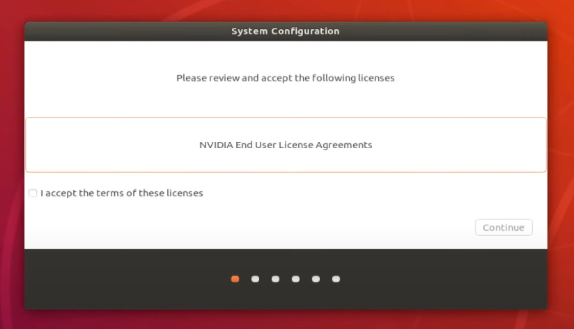

# Overview

The NVIDIA® Jetson Nano™ Developer Kit is a small AI computer for makers, learners, and developers. After following along with this brief guide, you’ll be ready to start building practical AI applications, cool AI robots, and more.

# Persiapan

Sebelum memulai membaca artikel ini, pastikan sebelumnya pengguna telah memiliki prasyarat perangkat keras yang diperlukan sebagai berikut :

-   Jetson Nano Developer Kit
-   Catu daya micro usb dengan spesifikasi tegangan 5V dan arus yang mampu ditangani minimal 3A (untuk 2GB)
-   MicroSD Card (direkomendasikan menggunakan yang berukuran 64 GB)
-   Kabel HDMI dan Monitor Komputer / TV
-   Keyboard dan Mouse usb
-   USB Wifi module ( jika bukan tipe wifi )

# Flash OS ke microSD Card

Jetson Nano menggunakan microSD Card untuk menyimpan OS yang akan dijalankan. Berikut adalah langkah flashing OS / Image Jetson Nano ke microSD Card pada komputer Windows.

Link getting started dapat dilihat pada halaman : <br />

https://developer.nvidia.com/embedded/learn/get-started-jetson-nano-devkit

-   Download OS/Image Jetson nano disini (Jetson Nano 2GB): <br /> https://developer.nvidia.com/jetson-nano-2gb-sd-card-image

    > untuk tiap versi jetson memiliki OS/Image berbeda silahkan sesuaikan dengan kebutuhan anda

-   Masukan microSD Card ke komputer dengan sdcard reader
    Jika sd card split menjadi banyak drive saat dipasang pada komputer solusi dapat dilihat bagian troubleshoot

-   format microSD Card menggunakan SD Card Formater yang dapat didownload disini : <br />
    https://www.sdcard.org/downloads/formatter_4/eula_windows/

    

-   Flash OS menggunakan aplikasi Balena Etcher. Dapat di download disini : <br /> https://www.balena.io/etcher <br />
    

<br />
<br />

# Boot Setup

-   Jika sudah selesai di flash, cabut microSD dari komputer dan pasangkan pada slot microSD di Jetson Nano Developer Kit.

    

-   Selanjutnya pasangkan pheriperal lainya (monitor, mouse, keyboard, micro usb power supply/barrel jack) ke Jetson Nano

    

-   Hubungkan micro usb power supply/barrel jack ke sumber listrik.

    > **CATATAN!** Jika menggunakan barrel jack sebagai sumber power, jangan lupa hubungkan jumper J48 pada Jetson Nano,

    

-   Selanjutnya kita akan melihat tampilan OS Jetson Nano di monitor.

-   Setelah itu, kita perlu setup Jetson Nano untuk pertama kalinya, diantaranya :

    -   Review and accept NVIDIA Jetson software EULA
    -   Select system language, keyboard layout, and time zone
    -   Create username, password, and computer name
    -   Select APP partition size - it is recommended to use the max size suggested (default)

        

-   Setelah mengisi beberapa pertanyaan, anda akan melihat layar sebagai berikut :

    

-   Selamat anda berhasil melakukan instalasi Jetson Nano
<br /><br /><br />
<hr />
<br /><br />

# Remote Access

## Remote Desktop

### <b>Jetson</b>

-   Jalankan terminal pada jetson nano dan lakukan command berikut :

    ```
    sudo apt update
    sudo apt install xrdp -y
    ```

-   Setelah itu cek ip dari jetson nano dengan command berikut :

    ```
    ifconfig
    ```

### <b>Windows</b>

-   silahkan buka remote desktop dengan akses ke ip jetson nano :

    

-   Minimalkan display untuk meringankan proses remote seperti pada gambar berikut :

    -   Set resolusi : 1280 x 1024
    -   Color depth : 16 Bit
    -   Connection speed : Modem (56 kbps)
    -   Uncheck 'Presistance bitmap caching'

        

-   Silahkan login menggunakan username dan password jetson nano anda

    

## SSH Connection using Putty

PuTTY adalah aplikasi open-source yang sering digunakan untuk melakukan remote access, seperti RLogin, SSH dan Telnet. Tujuan disini adalah memudahkan remote access command line pada jetson melalui remote computer.

-   Install putty dari alamat berikut :

    https://www.chiark.greenend.org.uk/~sgtatham/putty/latest.html

-   Buka putty dan masukkan ip dan ssh port (default 22) pada jetson anda kemudian klik open: <br>
    

-   Login dengan username dan password pada jetson nano :<br>
    

## SSHFS

SSHFS (SSH Filesystem) adalah klien filesystem berdasarkan FUSE untuk memasang direktori jarak jauh melalui koneksi SSH. Saat bekerja dengan machine learning akan memudahkan kita dalam melakukan copy data dari PC kita kedalam jetson.

### <b>Jetson</b>

-   Jalankan terminal pada jetson nano dan jalankan command berikut :

    ```
    sudo apt install sshfs
    ```

### <b>Windows</b>

-   Masuk ke github repository winsp pada alamat berikut : <br />
    http://www.secfs.net/winfsp/rel/

-   Install aplikasi winfsp dengan default parameter.
-   Masuk ke github repository sshfs pada alamat : <br />
    https://github.com/billziss-gh/sshfs-win
-   Unduh stable release untuk SSHFS-WIN
    
-   Setelah berhasil melakukan install klik kanan pada `This PC` kemudian pilih `Map Network Drive`
-   Tulis command sebagai berikut : <br />
    `\\sshfs\<jetson-username>@<jetson-host>`

    

-   Anda akan diminta memasukkan password dari jetson nano anda, masukkan password teresbut.
-   Jika berhasil maka akan muncul drive Z: sesuai pada setting kita sebelumnya.

    

<br /><br />

# Setup VNC

https://developer.nvidia.com/embedded/learn/tutorials/vnc-setup

# FAQ

## SD card split into multiple drives

The Disk Management tool may not let you work on SD cards and flash disks with partition tables. diskpart will work, though.

-   Open the Start menu, type `diskpart` and press Enter. You may have to confirm UAC prompt.
-   Type `list disk` Enter. Take note of card's disk number.
-   `select disk X` Enter (X is disk number from previous command.
-   Type `clean` Enter - this will overwrite partition table with zeros - all data will be lost.
-   Use Windows Explorer to initialize the SD card/flash disk.

## Force close Remote Desktop

-   Install xfce4

    ```
    sudo apt install xfce4
    ```

-   Comment out the last two lines in /etc/xrdp/startwm.sh
-   Add the following line to /etc/xrdp/startwm.sh
    ```
    startxfce4
    ```
-   Restart xrdp
    ```
    sudo service xrdp restart
    ```

---

# Remote Development

Pada kali ini, akan dibahas cara melakukan remote development (create, execute & debug code) pada Jetson Nano menggunakan Visual Studio Code Remote Development Extension.


# 1. Install Visual Studio & Plugin

-   Download Visual Studio Code pada link berikut <br />
    [https://code.visualstudio.com/download](https://code.visualstudio.com/download)
-   Install dan Jalankan Visual Studio Code pada Komputer anda.
-   Selanjutnya Install Extension **Remote Development** pada Visual Studio Code, tekan `CTRL + SHIFT + X` untuk membuka **Extension Manager**

-   Setelah itu masukan di pencarian Extension Manager dengan keyword "Remote Development", pilih extension dengan nama tersebut, lalu klik install.

    

-   Jika proses installasi berhasil, akan muncul side menu Remote Development, Klik menu tersebut, sehingga muncul side panel seperti berikut :
    

<br /><br />

# 2. Remote SSH menggunakan Visual Studio Code ke Jetson Nano

-   Agar kita dapat melakukan remote development pada Jetson Nano, Visual Studio Code perlu terhubung terlebih dahulu ke Jetson Nano via SSH.
-   Klik tombol `F1` pada keyboard untuk membuka list command pada VS Code, masukan pencarian dengan keyword `"SSH"`, sehingga tampak seperti berikut.

    

-   Pilih **Remote-SSH: Add New SSH Host…** sehingga akan muncul field input SSH Connection, masukan **ssh \<username\>@\<IP Jetson Nano\>** lalu klik enter.

    

-   Selanjutnya pilih lokasi untuk menyimpan SSH config tersebut
-   Lalu klik `F1` kembali, dan pilih Remote SSH: Connect Current Window to Host…

    

-   Pilih koneksi yang dibuat sebelumnya
-   Pilih platform Linux
-   Masukan password Jetson Nano
-   Tunggu beberapa saat sampai proses setting SSH selesai

# 3. Create File, Execute & Debug Remote Code

> **CATATAN!** <br />Pastikan VS Code sudah terkoneksi ke Jetson Nano, ditandai dengan adanya IP Jetson Nano di pojok kiri bawah VS Code.

Sekarang kita akan coba demonstrasikan proses create, execute dan debug code Jetson Nano dari Visual Studio Code.

-   Buka folder Document pada Jetson Nano pada path `/home/jetson/document` <br>
    
-   Masukkan password jetson nano
-   Setelahnya kita bisa mengakses file & direktori pada Jetson Nano dari VS Code
-   Buat folder baru dengan nama H1 dengan cara `klik kanan` pada `explorer window`, kemudian Pilih `New Folder` <br>
    

-   Kita akan membuat program Python sederhana untuk penjumlahan bilangan beri nama `penjumlahan.py` <br>

    ```
    def tambah(a, b):
        return a + b

    a = 2
    b = 3

    c = tambar(a, b)

    print(c)
    ```

-   Pada toolbar klik `Run` kemudian `Start Debugging`
-   Selanjutnya kita perlu install Python Extension untuk VS Code <br>

    

-   Pilih `Python` dibagian extension, kemudian Klik `install in SSH : <jetson ip>`
-   Selanjutnya kita perlu atur interpreter yang akan digunakan VS Code untuk mengeksekusi program Python, defaultnya adalah Python 3.x
-   Run & Debug Program Python di Jetson Nano menggunakan VS Code, terlihat VS Code dapat melakukan proses debugging program python secara remote yang ada di Jetson Nano dengan klik tombol `Run` diikuti dengan `Start Debugging`
-   Setelah di debug, pada program tersebut, terdapat error penamaan fungsi _tambah_, kita bisa klik tombol step-over pada panel debug VS Code untuk melihat respon program setelah adanya error.

    

-   Selanjutnya kita fixing bagian fungsi tersebut lalu tambahkan breakpoint didalam function dengan cara klik kanan pada baris program yang ingin ditambahkan breakpoint, Setelah itu jalankan Run & Debug kembali, untuk menjalankan dan men-debug program python tersebut.

-   Jika berhasil dijalankan maka hasil akan tampil pada `Terminal Window`

<br />
<br />

# Reference

-   Remote Development using SSH : <br />
    https://code.visualstudio.com/docs/remote/ssh

-   Python debug configurations in Visual Studio Code : <br />
    https://code.visualstudio.com/docs/python/debugging
